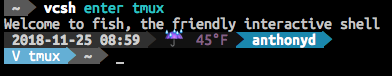

# Powerline VCSH repo

A [Powerline][1] segment for showing the current [VCSH][4] repo.



## Glossary

* 'V <repo>': where <repo> is the current VCSH repo activated

## Installation

```bash
pip install powerline-vcsh
```

OR

```bash
pip install --user git+git://github.com/taintedkernel/powerline-vcsh
```

The VCSH repo segment defines a custom highlight group.  You will need to define this in your colorscheme (eg: `.config/powerline/colorschemes/default.json`):

```json
{
    "vcsh_repo":                  { "fg": "white", "bg": "darkcyan", "attrs": [] } }
}
```

You can activate the VCSH segment by adding to your segment config (eg: `.config/powerline/themes/shell/default.json`):

```json
{
    "function": "powerline_vcsh.vcsh_repo",
    "priority": 10
}
```

You will also need to restart powerline for the settings to take effect:

```bash
powerline-daemon --replace
```

## License
Licensed under the [MIT License][3]

[1]: http://powerline.readthedocs.io/en/master/index.html
[2]: https://github.com/taintedkernel/powerline-vcsh/blob/master/screenshot.png
[3]: https://github.com/taintedkernel/powerline-vcsh/blob/master/LICENSE
[4]: https://github.com/RichiH/vcsh
